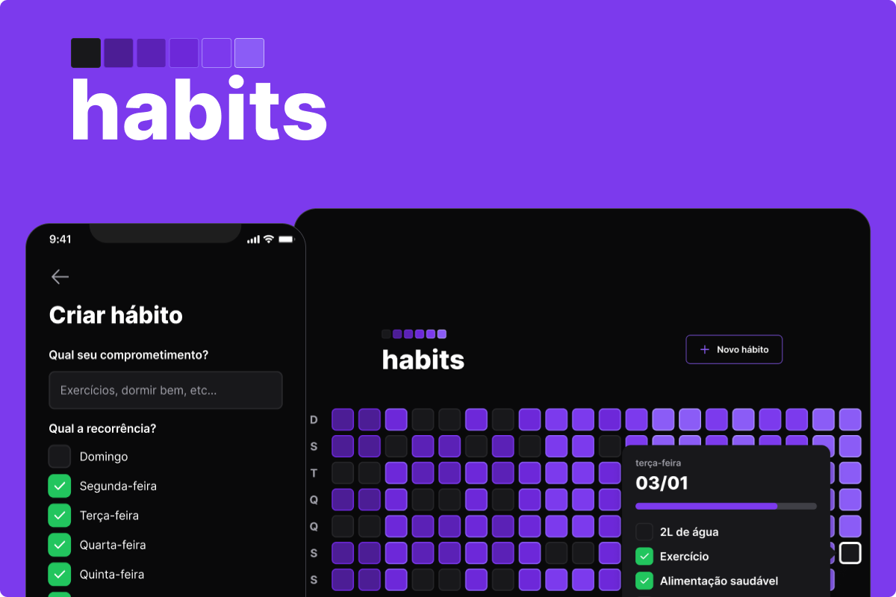

<h1 align="center">🟪 Habit Tracker</h1>

  <strong>Ferramenta de acompanhamento de hábitos para o usuário colocar em prática suas resoluções e metas, ou seja, registrar ações e acompanhar a evolução dos novos hábitos que deseja colocar na sua rotina</strong>
   

  

## Tecnologias e Ferramentas: 🚀
- REACT
- REACT Native
- NodeJS
- TypeScript
- Expo 
- Tailwind
